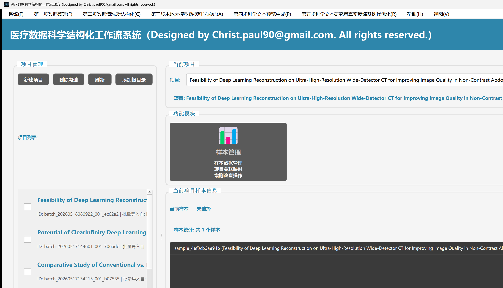
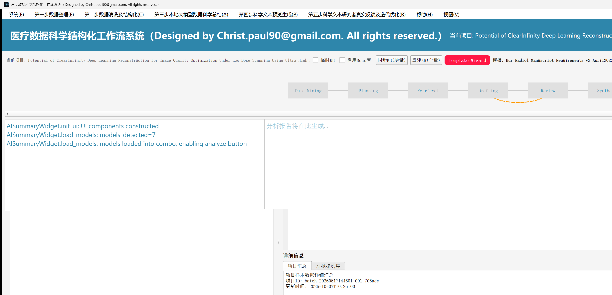
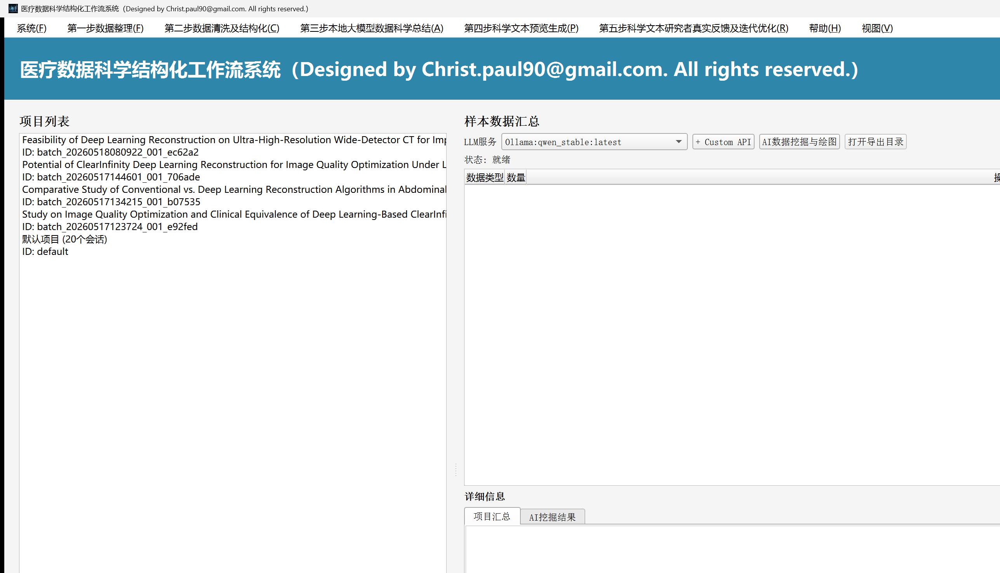
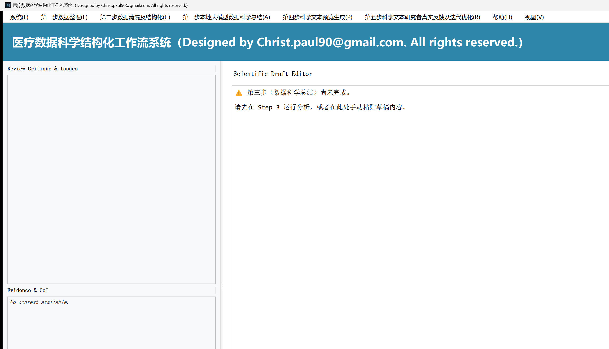
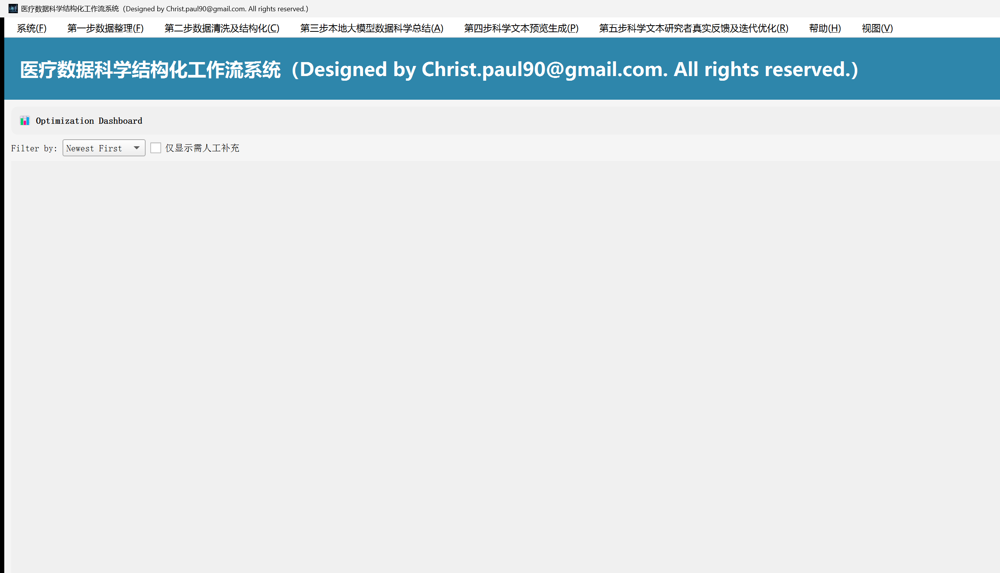
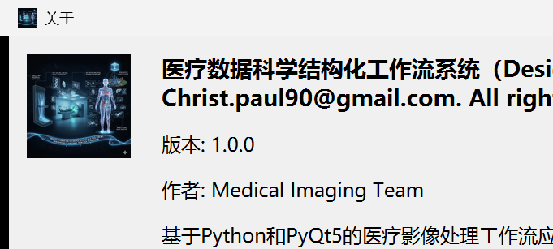
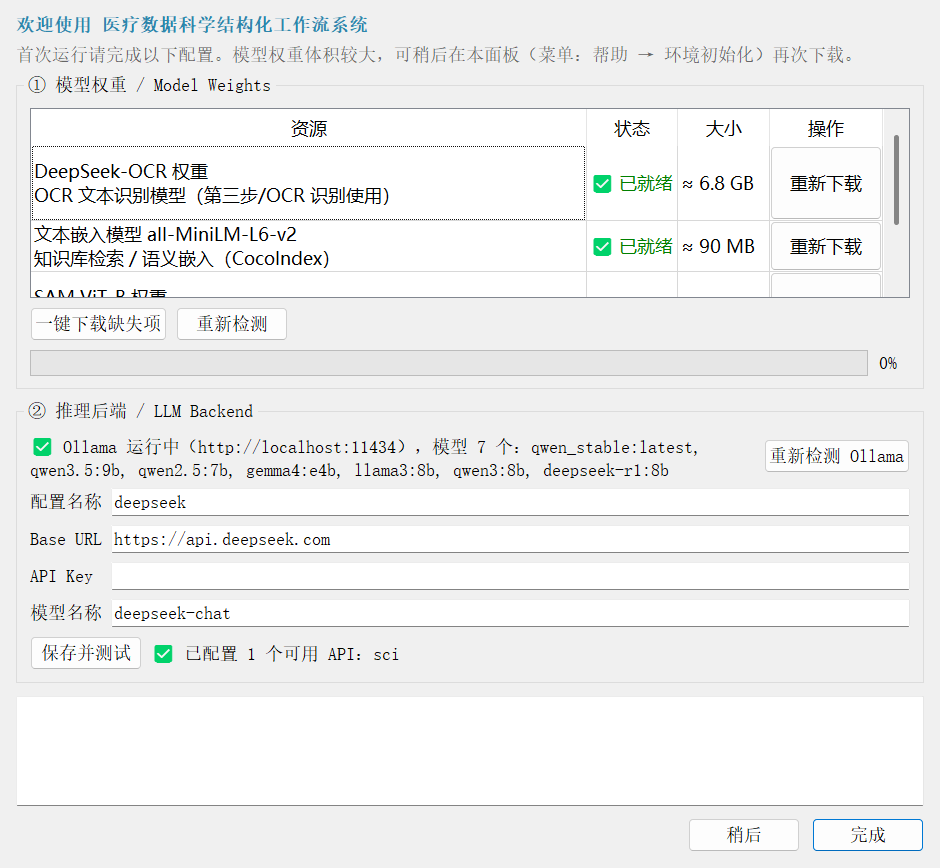

# 医疗数据科学结构化工作流系统 · Medical Imaging Workflow

> **Release V1.0** · 面向医学科研的 DICOM 影像处理 / 数据清洗 / 大模型总结 / 科学文本生成一体化工作流
> Designed by **Christ (hg3992260@gmail.com / hg3992260@qq.com)**

<p align="center">
  
</p>

<p align="center">
  
  
  
  
  
</p>

---

## 目录

- [一、项目简介](#一项目简介)
- [二、界面截图](#二界面截图)
- [三、五大工作流](#三五大工作流)
- [四、目录结构](#四目录结构)
- [五、环境要求](#五环境要求)
- [六、安装](#六安装)
- [七、模型与外部资源（不随仓库分发）](#七模型与外部资源不随仓库分发)
- [八、大模型后端配置：Ollama / 自定义 API](#八大模型后端配置ollama--自定义-api)
- [九、运行](#九运行)
- [十、打包](#十打包)
- [十一、关于 / About](#十一关于--about)
- [十二、免责声明](#十二免责声明)

---

## 一、项目简介

本系统把「医学科研数据 → 可发表科学文本」的全过程沉淀为一条 **5 步式可视化工作流**：

1. **数据整理**：项目管理、DICOM 影像 ROI 交互式分割（SAM）、OCR 识别、文本处理、样本管理；
2. **数据清洗及结构化**：表格/文献/影像数据的自动清洗、结构化与汇总；
3. **本地大模型数据科学总结**：调用 **本地 Ollama** 或 **任意 OpenAI 兼容 API**，把结构化数据转为科学结论与图表；
4. **科学文本预览生成**：按期刊/模板生成论文草稿与图表；
5. **研究者真实反馈与迭代优化**：审阅—修订—再审阅的闭环仪表盘。

> **本仓库为「纯源码 + 依赖清单」发行版：不含任何模型权重、CUDA 库、Ollama 二进制或安装包。**
> 这些重资源体积达数十 GB，请按 [第七节](#七模型与外部资源不随仓库分发) 单独获取。
> 大模型推理后端可在界面上自由选择 **本地 Ollama** 或 **外部 API 服务**。

## 二、界面截图

### 2.1 项目总览 / 功能模块


### 2.2 第三步 · 大模型数据科学总结（Data Mining → Review → Synthesis）


### 2.3 第二步 · 数据清洗及结构化（含 LLM 服务选择：Ollama / + Custom API）


### 2.4 第四步 · 科学文本预览生成


### 2.5 第五步 · 迭代优化仪表盘


### 2.6 关于对话框


### 2.7 首次运行初始化面板（模型权重下载 + API Key 配置）


## 三、五大工作流

| 步骤 | 菜单 | 说明 |
|------|------|------|
| 第一步 | 数据整理 | 项目管理、DICOM ROI 识别（SAM）、文本处理、OCR 识别、Magic Seg、样本管理 |
| 第二步 | 数据清洗及结构化 | 表格/文献结构化、数据汇总、AI 数据挖掘与绘图 |
| 第三步 | 本地大模型数据科学总结 | Ollama / 外部 API 驱动的科学总结、事实矩阵、评审 |
| 第四步 | 科学文本预览生成 | 模板化论文草稿与图表输出（docx / pptx / pdf） |
| 第五步 | 研究者真实反馈及迭代优化 | 反馈收集、优化仪表盘、反 AIGC / 语法 / 去重等技能链 |

## 四、目录结构

```
medical_imaging_workflow/
├── main.py                     # 程序入口（环境引导 / Ollama 探测 / 许可校验）
├── requirements.txt            # 依赖清单（仅代码依赖）
├── config/
│   ├── app_config.json         # 应用配置（名称/版本/主题/数据库…）
│   └── model_paths.json        # 外部模型路径映射
├── src/
│   ├── ai/                     # Agent 核心循环、逻辑链、评审、草稿生成、技能链
│   │   ├── agent_skills/       # 反AIGC / 语法 / 去重 / 片段手术 / PPT 生成…
│   │   └── tools/              # Python 代码执行工具等
│   ├── api/                    # 本地 Flask 服务（可选）
│   ├── core/                   # 配置、常量、事件总线、路径、主题无关核心
│   ├── models/                 # 数据模型
│   ├── services/               # 业务服务（DICOM/OCR/清洗/LLM/数据库/文献…）
│   ├── utils/                  # 主题、日志、GPU 管理、模型路径加载
│   ├── adapters/               # DeepSeek-OCR 适配器
│   └── cocoindex_compat/       # 兼容层（cocoindex 缺失时的降级实现）
├── ui/
│   └── widgets/                # PyQt5 界面：主窗口 + 各步骤 Widget + 对话框
├── license_manage/             # 授权管理（源码模式默认开放运行）
├── scripts/                    # 自检 / 回归测试脚本
├── tools/                      # 图标生成等辅助工具
├── docs/screenshots/           # README 截图素材
└── assets/                     # 仅图标（icon.ico / medlogo.png）
```

## 五、环境要求

- **操作系统**：Windows 10 / 11（其他平台未完整验证）
- **Python**：3.10 或 3.11（推荐 3.10，PyQt5 + PyTorch 生态最稳定）
- **硬件**：建议 NVIDIA GPU（≥ 8GB 显存）以运行本地大模型；纯 CPU 亦可运行 UI 与数据处理
- **内存**：≥ 16GB 建议

## 六、安装

```bash
git clone https://github.com/hg3992260/medical_imaging_workflow.git
cd medical_imaging_workflow

python -m venv .venv
.venv\Scripts\activate        # Windows

# 1) 如需 GPU：先安装带 CUDA 的 PyTorch（示例，按官网选择版本）
pip install torch torchvision --index-url https://download.pytorch.org/whl/cu121

# 2) 安装其余依赖
pip install -r requirements.txt

# 3) 运行
python main.py
```

> 源码/开发模式默认 **不强制授权激活**（`RSNA_LICENSE_ENFORCE=0`）。
> 如需强制校验：`set RSNA_LICENSE_ENFORCE=1`。

## 七、模型与外部资源（不随仓库分发）

以下资源需单独获取并放到指定目录（路径可在 `config/model_paths.json` 与界面中调整）：

| 资源 | 用途 | 建议放置路径 | 获取方式 |
|------|------|--------------|----------|
| Ollama 运行时 | 本地大模型推理 | 系统安装即可 | https://ollama.com/download |
| Ollama 模型 | 总结/抽取 | Ollama 默认模型目录 | `ollama pull qwen2.5:7b` 等 |
| DeepSeek-OCR 权重 | OCR 识别 | `assets/models/deepseek_ocr` | HuggingFace `deepseek-ai/DeepSeek-OCR` |
| SAM 权重 | 交互式分割 | `models/sam/sam_vit_b_01ec64.pth` | https://dl.fbaipublicfiles.com/segment_anything/ |
| Sentence-Transformers | 检索/嵌入 | `models/embedding/all-MiniLM-L6-v2` | HuggingFace `sentence-transformers/all-MiniLM-L6-v2` |
| Poppler（PDF→图片） | pdf2image | 加入 PATH | https://github.com/oschwartz10612/poppler-windows |

**可选 Python 包**（未列入 requirements，按需安装）：
```bash
pip install git+https://github.com/facebookresearch/segment-anything.git   # SAM
```

环境变量（可选）：
```bat
set RSNA_DEEPSEEK_OCR_DIR=D:\models\deepseek_ocr
set RSNA_DEEPSEEK_OCR_SOURCE_DIR=D:\DeepSeek-OCR-main
set OLLAMA_HOST=http://localhost:11434
```

## 八、大模型后端配置：Ollama / 自定义 API

程序在启动时会自动探测 **内置 Ollama**；**若不存在内置运行时，则回退到系统 Ollama 或外部 API**，不会强杀用户已有的 Ollama 进程。

界面提供两种后端（见 [2.3 数据清洗界面](#23-第二步--数据清洗及结构化含-llm-服务选择ollama--custom-api)）：

1. **本地 Ollama**
   - 安装 Ollama 并 `ollama pull <model>`；
   - 界面「LLM服务」下拉框会自动列出本机模型，直接选择即可。
2. **自定义 API 服务（OpenAI 兼容）**
   - 点击 **`+ Custom API`**，填写：
     - 名称（如 `deepseek`）
     - 服务模式 / API 类型
     - `base_url`（如 `https://api.deepseek.com`）
     - `api_key`
     - 模型名
   - 配置保存在 `config/custom_api_profiles.json`（已被 `.gitignore` 忽略，不会入库）。

相关环境变量：
```bat
set RSNA_OLLAMA_FORCE_BUNDLED=0        :: 0=使用系统/外部，1=强制内置
set RSNA_OLLAMA_KILL_OTHERS=0          :: 默认不清理系统 Ollama
set RSNA_LICENSE_ENFORCE=0             :: 0=开放模式
```

## 九、运行

```bash
python main.py
```

- **首次运行**会自动弹出 **「首次运行初始化 · 环境配置」** 面板：
  - **① 模型权重**：逐项显示 DeepSeek-OCR / 文本嵌入 / SAM 的**是否就绪**与体积，支持**单项下载**或**一键下载缺失项**（HTTP 直连 HuggingFace，无需 huggingface_hub，离线默认环境同样可用）；
  - **② 推理后端**：检测本地 **Ollama** 运行状态与模型列表；填写并**保存/测试**外部 **OpenAI 兼容 API**（Base URL / API Key / 模型名）。
  - 可点「稍后」跳过；之后随时通过菜单 **帮助 → 环境初始化** 重新打开。
- 首次启动会在 `database/` 生成 SQLite 数据库；
- 日志输出到 `logs/` 与 `startup.log`；
- 首次使用时请先「新建项目 / 添加根目录」导入数据。

## 十、打包

仓库提供 PyInstaller spec（`MedicalImagingWorkflow.spec`）用于生成 Windows 发行包。
打包会内联大量二进制与模型，体积可达数十 GB；请按需裁剪 `datas`。

```bash
pip install pyinstaller
pyinstaller --clean MedicalImagingWorkflow.spec
```

## 十一、关于 / About

程序内「帮助 → 关于」对话框展示版本、作者、核心功能与项目主页；
本版本为 **Release V1.0**，应用版本号 `1.0.0`。

- 版本 / Version：**1.0.0 (Release V1.0)**
- 作者 / Author：**Medical Imaging Team (hg3992260)**
- 项目主页：https://github.com/hg3992260/medical_imaging_workflow

## 十二、免责声明

本软件仅供 **科研与教学** 使用，**不得用于临床诊断或任何医疗决策**。
使用本软件产生的一切后果由使用者自行承担。模型输出可能包含错误，请务必人工核验。

---

<p align="center">© 2026 Medical Imaging Workflow · Released under the MIT License.</p>
