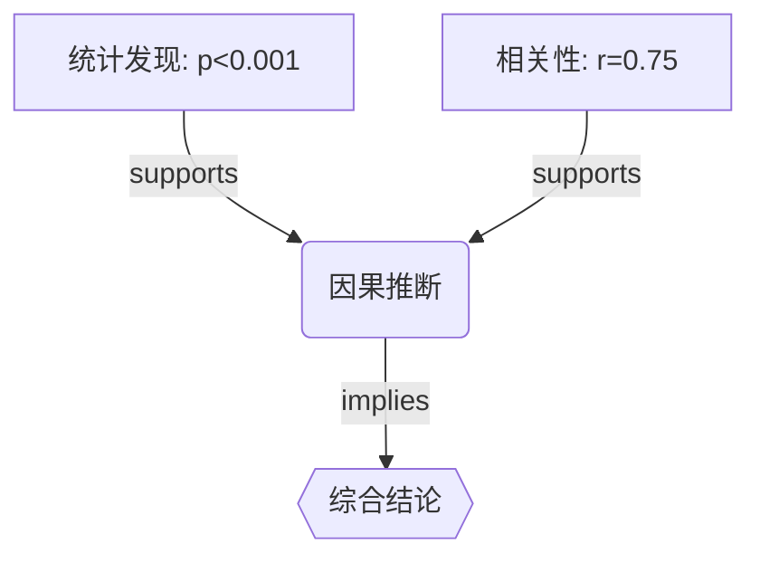

# Logic Chain Agent 设计文档

## 概述

Logic Chain Agent 是一个从多源数据中提取逻辑链条并生成论文草稿的智能Agent。它能够：

1. **从数据源提取逻辑关系** - OCR、DICOM、临床文本
2. **构建推理链** - 因果链、相关链、验证链
3. **生成论文草稿** - 结构化的学术论文框架

## 架构

```
┌─────────────────────────────────────────────────────────────┐
│                    Logic Chain Agent                        │
├─────────────────────────────────────────────────────────────┤
│                                                             │
│  ┌─────────────────┐  ┌─────────────────┐  ┌─────────────┐ │
│  │   Data Sources  │  │  Logic Chain    │  │   Paper     │ │
│  │                 │──│  Extraction      │──│   Draft     │ │
│  │  - OCR Data     │  │                 │  │   Generator │ │
│  │  - DICOM Data   │  │  - Nodes        │  │             │ │
│  │  - Text Data    │  │  - Edges        │  │  - Title    │ │
│  │  - Structured   │  │  - Chains       │  │  - Abstract │ │
│  │    Data         │  │                 │  │  - Sections │ │
│  └─────────────────┘  └─────────────────┘  └─────────────┘ │
│          │                    │                    │        │
│          ▼                    ▼                    ▼        │
│  ┌─────────────────────────────────────────────────────┐  │
│  │              Integration Service                      │  │
│  │                                                       │  │
│  │  - connect to AgentCoreLoopExecutor                   │  │
│  │  - connect to KnowledgeBase (RAG)                     │  │
│  │  - connect to DataAggregationService                  │  │
│  └─────────────────────────────────────────────────────┘  │
│                                                             │
└─────────────────────────────────────────────────────────────┘
```

## 核心组件

### 1. LogicChainExtractor

从多源数据提取逻辑节点和边：

```python
extractor = LogicChainExtractor()

# 从OCR数据提取
nodes = extractor.extract_from_ocr(ocr_data)

# 从DICOM数据提取
nodes = extractor.extract_from_dicom(dicom_data)

# 从文本数据提取
nodes = extractor.extract_from_text(text_data)

# 从所有数据源提取
nodes, edges = extractor.extract_all(ocr_data, dicom_data, text_data)
```

**支持的提取模式：**
- 统计显著性声明 (p值, r值, n值)
- 因果关系声明 (leads to, causes, 导致)
- 相关性声明 (correlates with, 相关)
- 矛盾/对比声明 (however, but, 相反)

### 2. InferenceChainBuilder

构建推理链：

```python
builder = InferenceChainBuilder()

# 构建推理链
chains = builder.build_chains(nodes, edges)

# 构建结论链
conclusion = builder.build_conclusion_chain(chains, key_findings)
```

**推理链类型：**
- `discovery` - 发现链：从证据到发现
- `validation` - 验证链：验证假设
- `comparison` - 比较链：比较结果
- `conclusion` - 结论链：综合结论

### 3. PaperDraftGenerator

生成论文草稿：

```python
generator = PaperDraftGenerator()

draft = generator.generate_draft(
    logic_chains=chains,
    nodes=nodes,
    project_context="...",
    style_guidelines="..."
)
```

**生成的章节：**
- Title (标题)
- Abstract (摘要)
- Introduction (引言)
- Methods (方法)
- Results (结果)
- Discussion (讨论)
- Conclusion (结论)

### 4. LogicChainAgent

整合所有组件的主Agent：

```python
agent = create_logic_chain_agent(
    llm_service=ollama_service,
    model="llama3",
    knowledge_base=kb,
    progress_callback=on_progress
)

result = agent.process(
    ocr_data=ocr_data,
    dicom_data=dicom_data,
    text_data=text_data,
    project_context="Medical imaging study"
)
```

## 数据结构

### LogicNode

```python
@dataclass
class LogicNode:
    node_id: str           # 节点唯一ID
    node_type: str         # 'premise', 'evidence', 'inference', 'conclusion'
    content: str           # 节点内容
    source_type: str       # 'ocr', 'dicom', 'text', 'literature', 'inference'
    source_id: str         # 来源ID
    confidence: float      # 置信度 0-1
    metadata: Dict         # 元数据
```

### LogicEdge

```python
@dataclass
class LogicEdge:
    edge_id: str           # 边唯一ID
    from_node: str         # 起始节点
    to_node: str           # 目标节点
    relation_type: str     # 'causes', 'implies', 'supports', 'contradicts', 'correlates'
    strength: float       # 推理强度 0-1
    evidence: str          # 支持证据
```

### InferenceChain

```python
@dataclass
class InferenceChain:
    chain_id: str          # 链唯一ID
    nodes: List[LogicNode] # 节点序列
    edges: List[LogicEdge] # 边序列
    chain_type: str        # 链类型
    narrative: str         # 自然语言叙述
    confidence: float      # 整体置信度
```

## 与现有系统集成

### AgentCoreLoopExecutor

```python
executor = AgentCoreLoopExecutor(kb=kb, db_service=db)

# 使用逻辑链增强的论文生成
result = executor.execute_with_logic_chain(
    raw_content="...",
    project_id="project_123"
)
```

### DataAggregationService

```python
# 自动从患者病例提取逻辑链
from src.services.logic_chain_integration import LogicChainIntegration

integration = LogicChainIntegration(db_service=db)
result = integration.process_project_data(project_id="project_123")
```

### KnowledgeBase (RAG)

```python
# 使用知识库增强上下文
result = integration.process_project_data(
    project_id="project_123",
    use_rag=True
)
```

## 可视化输出

### Mermaid图表

```python
mermaid = integration.export_logic_chain_visualization(result, format="mermaid")
```

输出示例：


### GraphML (Gephi)

```python
graphml = integration.export_logic_chain_visualization(result, format="graphml")
```

## 使用场景

1. **医学影像研究**
   - 从DICOM和ROI数据提取影像特征
   - 构建特征与诊断结果的关联链
   - 生成放射学论文草稿

2. **临床数据分析**
   - 从临床文本提取患者信息
   - 构建症状-诊断-治疗的推理链
   - 生成临床研究报告

3. **统计结果整合**
   - 从OCR识别的表格数据提取统计结果
   - 构建统计显著性的证据链
   - 生成包含统计论证的论文

## 扩展点

1. **添加新的数据源**
   - 在 `LogicChainExtractor` 中添加新的提取方法
   - 例如：`extract_from_dicom_web()`, `extract_from_pacs()`

2. **自定义推理规则**
   - 在 `InferenceChainBuilder` 中添加新的推理模式
   - 例如：特定领域的因果关系检测

3. **自定义论文模板**
   - 在 `PaperDraftGenerator` 中添加新的章节模板
   - 例如：特定期刊的格式要求

## 文件结构

```
src/ai/
├── logic_chain_agent.py        # 核心Agent模块
├── logic_chain_agent_examples.py # 使用示例
├── agent_core_loop.py           # 核心循环执行器 (已集成)
└── __init__.py                  # 模块初始化

src/services/
└── logic_chain_integration.py   # 集成服务
```